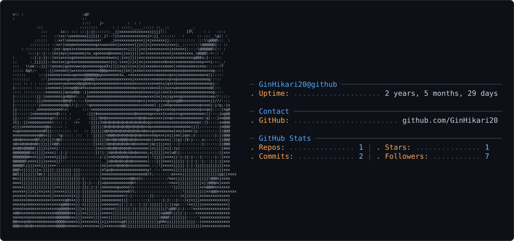

### Hi there! 👋

I'm a third-year university student with a strong passion for mobile development, specifically building cross-platform applications using **Flutter**. 

I love bringing ideas to life through code. Recently, I developed and launched **[Kibo: Learn Japanese Grammar](https://play.google.com/store/apps/details?id=com.kibo.jlptgrammar)**, an app designed to help users master Japanese grammar, which is now available on the Google Play Store! Feel free to check it out.

<picture>
  <source media="(prefers-color-scheme: dark)" srcset="dark_mode.svg" />
  <source media="(prefers-color-scheme: light)" srcset="light_mode.svg" />
  
</picture>
